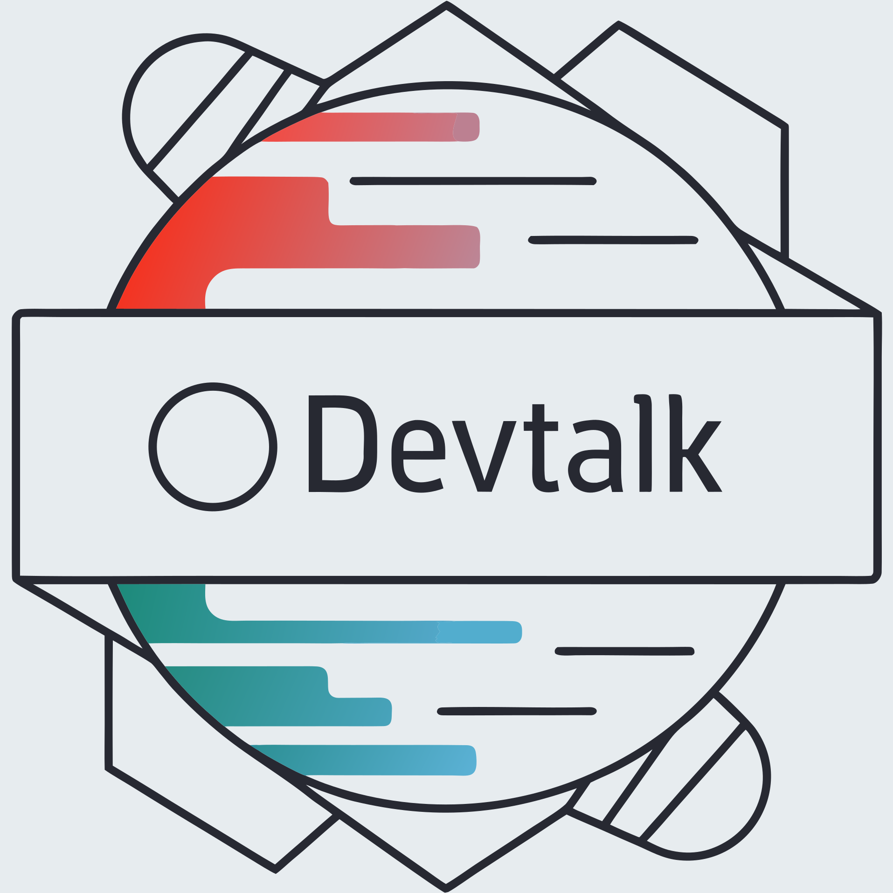

# DevTalk

<p align="center">
  
</p>

<p align="center">
  A polished AI playground for testing models, comparing prompts across tabs, simulating tools, and inspecting responses in one place.
</p>

<p align="center">
  
  
  
  
</p>


> [!NOTE]
> DevTalk stores its working state locally in your browser, including saved models, tabs, tool definitions, and preferences. Requests only leave your machine when you send them to a configured provider endpoint or through the optional proxy routes.

## Highlights

- Compare prompt runs across multiple tabs with separate tab-level system prompts.
- Save and reuse model configurations with API key, base URL, temperature, max tokens, and vision support.
- Work with OpenAI-compatible APIs, Ollama-style endpoints, and Lightning.ai-style token handling.
- Toggle streaming, Markdown rendering, tools, proxy usage, and local-network proxy bypass from the UI.
- Attach images for vision-capable models.
- Simulate tool calls with editable JSON schemas and in-browser JavaScript implementations.
- Regenerate assistant replies into version history and switch between versions later.
- Inspect response metadata including timing and token usage.
- Generate request snippets in `curl`, Python `requests`, and Node `fetch`.
- Export and import both model libraries and full playground sessions.

## Screens and Workflow

DevTalk is organized into three working areas:

- Left panel: model configuration and saved model library
- Center panel: tabs, chat history, composer, and image attachments
- Right panel: token usage, behavior toggles, tools editor, tool code, and generated request code

That layout makes it easy to tweak a model, run a prompt, inspect the result, then immediately compare again in another tab.

## Features

### Model and Provider Handling

- Reusable saved model library
- Per-model API key, base URL, temperature, max token limit, and vision toggle
- Support for direct browser calls or proxy-based calls
- Automatic proxy bypass for localhost and local network URLs when enabled
- Import/export for saved model presets

### Chat Experience

- Multi-tab workflow with persistent tab state
- Per-tab system prompts
- Real-time streaming with `Send` to `Stop` state switching
- Message editing, deletion, copy, and resend-from-here actions
- Assistant response regeneration with version navigation
- Image attachment support for vision-capable models
- Mobile-friendly layout with slide-out side panels

### Tooling and Inspection

- Editable tool schema JSON
- In-browser JavaScript tool simulation
- Automatic insertion of tool results into the conversation
- Toggleable Markdown rendering with syntax highlighting
- Copy buttons for code blocks
- Response metadata details such as:
  - provider label
  - duration
  - prompt tokens
  - completion tokens
  - total tokens
  - tokens per second
- Token usage tracking for the active tab and conversation history
- Code generation for `curl`, Python, and Node

### Persistence and Portability

- Local browser persistence via `localStorage`
- Full session export/import including:
  - models
  - tabs
  - chat history
  - tools JSON
  - tool code
  - active tab state
- Backward-compatible legacy import support for older chat exports

## Stack

- Frontend: vanilla JavaScript, HTML, CSS
- Markdown rendering: [Marked.js](https://marked.js.org/)
- Syntax highlighting: [Highlight.js](https://highlightjs.org/)
- Proxy routes: [`api/proxy.js`](api/proxy.js) and [`api/proxy-stream.js`](api/proxy-stream.js)

## Project Structure

```text
DevTalk/
├─ api/
│  ├─ proxy.js
│  └─ proxy-stream.js
├─ public/
│  ├─ app.js
│  ├─ index.html
│  ├─ styles.css
│  └─ assets/
├─ package.json
└─ README.md
```

## Running Locally

This repository currently does not include npm scripts or installed package dependencies, so the older `npm install` and `npm run dev` instructions are no longer accurate.

### Frontend Only

If your provider supports direct browser requests, you can serve the `public/` folder with any static file server and disable proxying in the UI.

```bash
python -m http.server 3000 --directory public
```

```bash
npx serve public
```

### With Proxy Routes

If you want to use `/api/proxy` and `/api/proxy-stream`, run the project in an environment that supports Vercel-style serverless functions or deploy it to Vercel.

The proxy mode is useful when:

- your provider blocks browser-origin requests with CORS
- you prefer requests to flow through your own server route
- you want streaming to pass through the built-in proxy endpoint

## Quick Start

1. Add a model in the left panel.
2. Enter the provider base URL and API key.
3. Enable `Vision Model` if that model should receive images.
4. Turn on tools, Markdown, streaming, or proxy options in the right panel as needed.
5. Start chatting in the center panel.
6. Use additional tabs to compare prompt variants, providers, or settings.

## License

Distributed under the MIT License. See [LICENSE](LICENSE).

## Author

Created by [Myster-Pmf](https://github.com/Myster-Pmf)
