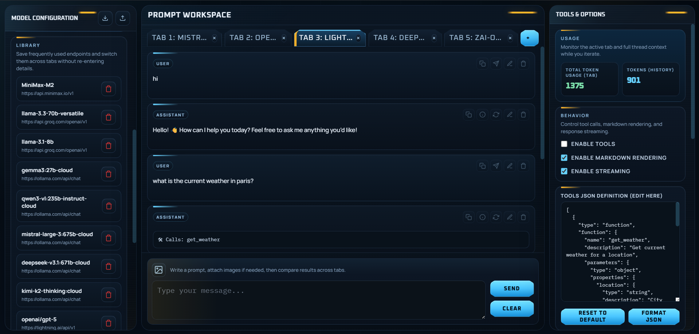

# DevTalk

DevTalk is a lightweight AI playground for testing chat models, comparing runs across tabs, simulating tools, and inspecting responses without leaving the browser.

It is built as a static frontend in `public/` with two small serverless proxy handlers in `api/`.



> Note
> Most state is stored locally in your browser, including saved models, tab history, tool definitions, and UI preferences. Requests only leave your machine when you send them to the configured model endpoint or through the optional proxy.

## What It Can Do

- Manage a reusable model library with API key, base URL, temperature, max tokens, and vision capability per model.
- Work in multiple chat tabs, with per-tab system prompts and tab renaming.
- Send requests to OpenAI-compatible endpoints, Ollama-style endpoints, and Lightning.ai-style endpoints that expect `max_completion_tokens`.
- Toggle server-side proxying, with an option to automatically bypass the proxy for localhost and LAN endpoints.
- Stream responses in real time and stop generation mid-response.
- Attach images for vision-capable models.
- Simulate tool calling with editable tool JSON plus a JavaScript tool implementation editor.
- Regenerate assistant replies into version history and switch between versions later.
- Inspect response details such as duration, provider label, prompt tokens, completion tokens, total tokens, and tokens per second.
- Toggle Markdown rendering for responses, including syntax highlighting and copy buttons for code blocks.
- Edit, delete, copy, and resend messages from any point in a conversation.
- Generate ready-to-use request code in `curl`, Python `requests`, or Node `fetch`.
- Import and export saved models.
- Export and import playground sessions.
- Persist the working state locally so the app restores on reload.
- Use the app on mobile with slide-out side panels.

## Stack

- Frontend: vanilla JavaScript, HTML, CSS
- Rendering: [Marked.js](https://marked.js.org/) and [Highlight.js](https://highlightjs.org/)
- Proxy: Vercel-style serverless functions in [`api/proxy.js`](api/proxy.js) and [`api/proxy-stream.js`](api/proxy-stream.js)

## Project Structure

```text
DevTalk/
|- api/
|  |- proxy.js
|  `- proxy-stream.js
|- public/
|  |- app.js
|  |- index.html
|  |- styles.css
|  `- assets/
|- package.json
`- README.md
```

## Running Locally

This repo currently has no npm scripts and no installed package dependencies. The old `npm run dev` flow documented previously is no longer accurate.

### Option 1: Frontend only

If you only need the UI and plan to call providers directly from the browser, serve the `public/` folder with any static file server.

Examples:

```bash
# Python
python -m http.server 3000 --directory public
```

```bash
# Node
npx serve public
```

In this mode, leave proxying disabled in the UI if your target endpoint supports direct browser requests.

### Option 2: Full app with proxy routes

If you want to use the built-in `/api/proxy` and `/api/proxy-stream` routes, run the project in an environment that supports Vercel-style serverless functions, or deploy it to Vercel.

The proxy is useful when:

- your provider blocks browser-origin requests with CORS
- you want the browser to call your own server route instead of the provider directly
- you want the app to stream through the proxy endpoint

## Usage

1. Add a model in the left panel.
2. Pick the base URL for your provider or local server.
3. Enable `Vision Model` if that model should receive attached images.
4. In the right panel, decide whether you want tools, Markdown rendering, streaming, and proxying enabled.
5. Start chatting in the center panel.
6. Use tabs to compare prompts, providers, or prompt variants side by side.

## Feature Notes

### Model Handling

- Saved models are reusable across tabs.
- Import skips duplicate models when possible.
- Tabs keep their own selected model reference and system prompt.

### Chat Workflow

- `Send` turns into `Stop` while a response is streaming.
- Assistant replies can store multiple regenerated versions.
- User messages can be resent from a specific point to branch the conversation.

### Tool Simulation

- Tool schemas are edited as JSON.
- Tool implementations are authored in JavaScript and executed in-browser.
- When a model returns tool calls, DevTalk simulates them and appends tool results into the chat.

### Response Inspection

- The right panel tracks total token usage for the active tab.
- History token count uses stored values when available and falls back to estimation otherwise.
- Assistant messages can expose per-response metadata from the current version.

### Imports and Exports

- Model export/import is separate from full chat export/import.
- Full chat export includes models, tabs, tool definitions, tool code, and Markdown preference.
- Legacy chat imports with only `messages` are still supported.

## What Changed From The Old README

The previous README was behind the current codebase. It missed or misstated several things, including:

- there is no current `npm run dev` script
- model import/export support exists
- image attachments and vision-model handling exist
- assistant response versioning exists
- response metadata/details exist
- proxy bypass for local network endpoints exists
- code generation exists for `curl`, Python, and Node
- message editing, resend, regenerate, and per-message actions are richer than previously documented

## License

Distributed under the MIT License. See [LICENSE](LICENSE).

## Author

Created by [Myster-Pmf](https://github.com/Myster-Pmf)
